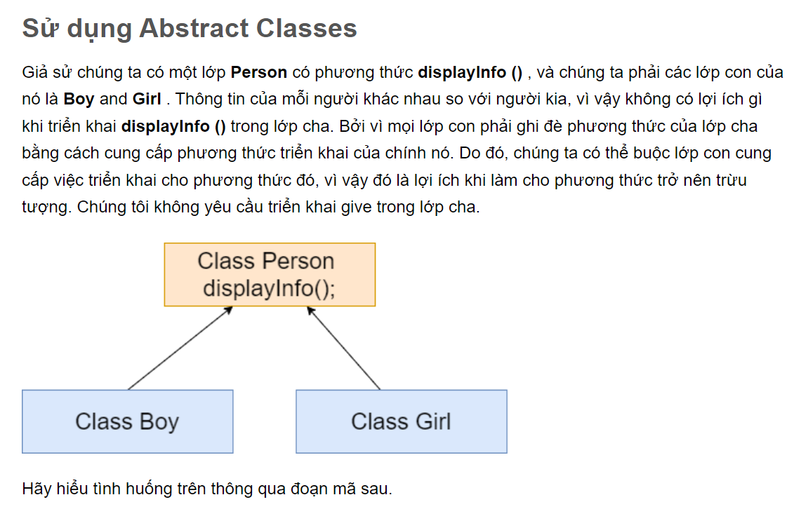

Đầu ra

Tên tôi là Johnathon

Tên tôi là Grecia

Giải trình:

Như chúng ta thấy rằng trong đoạn mã trên, chúng ta đã triển khai phương thức trừu tượng trong hai lớp con theo yêu cầu của nó và sau đó chúng ta gọi phương thức displayInfo () bằng cách sử dụng đối tượng của cả hai lớp.
